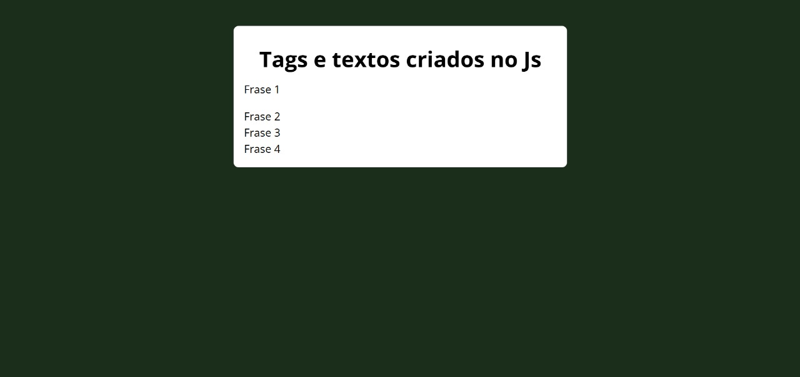

# 🧩 Tags e Textos com JavaScript

## 📌 Descrição
Exercício de **JavaScript** onde todos os elementos HTML da página são **criados dinamicamente via código JS**.  
Ao carregar a página, o script gera uma estrutura com título e frases diretamente no DOM, sem nenhum conteúdo prévio no HTML.

> Este exercício reforça o uso de `document.createElement`, `appendChild`, e manipulação de conteúdo com `innerText`.

---

## 🛠️ Tecnologias utilizadas
- HTML5 (estrutura mínima)
- CSS3 (estilização)
- JavaScript (criação de elementos e conteúdo)

---

## 📸 Preview


---

## 🚀 Como visualizar

Você pode abrir o projeto localmente:

1. Baixe ou clone este repositório:
   - Clique em **Code > Download ZIP** e extraia os arquivos  
   - ou use o comando:
     ```bash
     git clone https://github.com/WellingthonSchuh/HTMLnoJS.git
     ```

2. Abra o arquivo `index.html` em qualquer navegador moderno.

Ou

1. Acesse o site:
   - https://wellingthonschuh.github.io/HTMLnoJS/

> ⚠️ O HTML está vazio — todo o conteúdo é gerado pelo JavaScript ao carregar a página.

---

## 📚 Aprendizados
- Criação de elementos HTML com `document.createElement`
- Inserção de conteúdo com `innerText` e `appendChild`
- Manipulação do DOM com JavaScript puro
- Organização de estrutura visual sem HTML pré-definido

---

## 👨‍💻 Autor
Feito por **Wellingthon Schuh**  
🔗 [LinkedIn](https://www.linkedin.com/in/wellingthonschuh)
